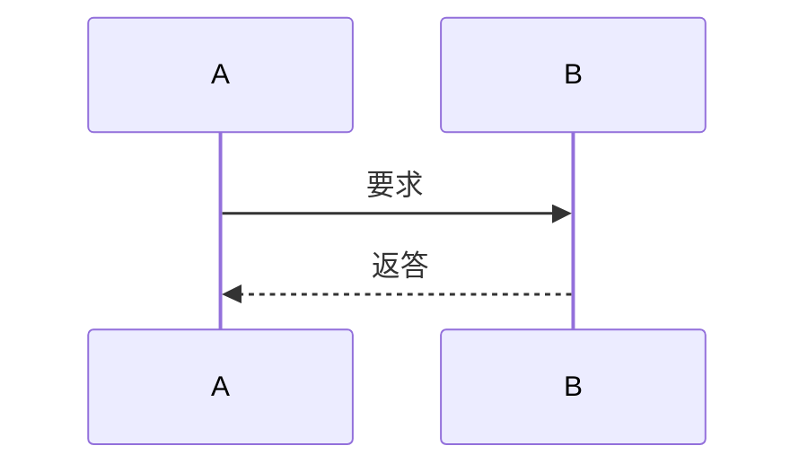

# test0325 <!-- omit in toc -->
---
<!-- TOC -->
- [1. セクション1](#1-セクション1)
  - [1.1. セクション1.1](#11-セクション11)
- [2. セクション2](#2-セクション2)
  - [# 2.1. <font face = "MSPゴシック">セクション3</font>](#-21-font-face--mspゴシックセクション3font)
  - [2.2. <font color = gray size = "1" face = "メイリオ"> セクション3.1</font>](#22-font-color--gray-size--1-face--メイリオ-セクション31font)
  - [2.3. <font face = "MSPゴシック"> セクション3.1</font>](#23-font-face--mspゴシック-セクション31font)
<!-- TOC -->
# 1. セクション1
- たかひろ
> たかひろ

|  ttt   | aaa |
| ------ | --- |
| めんこ | 対  |
## 1.1. セクション1.1


st=>start:Start:>http://www.google.com[blank]
# 2. セクション2
```flow
開始=>start: はじめ
終了=>end: おわり

分岐(align-next=no)=>condition: おなかすいた？
処理1=>operation: おやつを手に取る
定義済み処理=>subroutine: おいしく食べる

分岐2=>condition: 満足した？
処理2=>operation: それは残念

開始->分岐
分岐(yes)->処理1
分岐(no)->処理2(top)->分岐

処理1->定義済み処理(right)->分岐2
分岐2(yes)->終了
分岐2(no, bottom)->処理1
```
[株式会社アーティス](http://www.asobou.co.jp/)の運営サイト[名刺工房](http://meishi.artisj.com/index.html)
- [1. セクション1](#1-セクション1)
  - [1.1. セクション1.1](#11-セクション11)
- [2. セクション2](#2-セクション2)
  - [# 2.1. <font face = "MSPゴシック">セクション3</font>](#-21-font-face--mspゴシックセクション3font)
  - [2.2. <font color = gray size = "1" face = "メイリオ"> セクション3.1</font>](#22-font-color--gray-size--1-face--メイリオ-セクション31font)
  - [2.3. <font face = "MSPゴシック"> セクション3.1</font>](#23-font-face--mspゴシック-セクション31font)
# 2.1. <font face = "MSPゴシック">セクション3</font>
---
___
<font face = "メイリオ">っっっか</font>
<font face = "游ゴシック">っっっか</font>
<font face = "MSPゴシック">っっっか</font>


## 2.2. <font color = gray size = "1" face = "メイリオ"> セクション3.1</font>
## 2.3. <font face = "MSPゴシック"> セクション3.1</font>

---

###　Markdown 字体?色改?

?色字体：<font color =green>Markdown</font>
?色字体：<font color = red>Markdown</font>
?色字体：<font color =blue>Markdown</font>


###　Markdown 字体大小改?

size?1：<font size ="1">Markdown</font>
size?5：<font size = "5">Markdown</font>
size?10：<font size ="10">Markdown</font>


###　Markdown 字体?式改?

微?雅黑字体: <font face ="微?雅黑">Markdown</font>
宋体字体：<font face = "宋体">Markdown</font>
楷体字体：<font face ="楷体">Markdown</font>
~~あいうえお~~
***<font color = blue size = "5" facce = メイリオ> 求められるスキル </font>***
***<font color = blue size = "5" face = "メイリオ"> 求められるスキル </font>***

***あいうえお***
***求められるスキル***

- [x] 散歩
- [ ] ショッピング

あああい[^1]
[^1]:あいうえお「

金融の面白さ？
- 興味を持ったきっかけ：ナニワ金融道、クオンツ職
- 社会に対する影響力の大きさ

今まで影響力の大きさを好んだ事例？：
もしくは対比：今までは理学部で、理論の研究をしてきた。そろそろ実社会のことを学びたいと思った。


